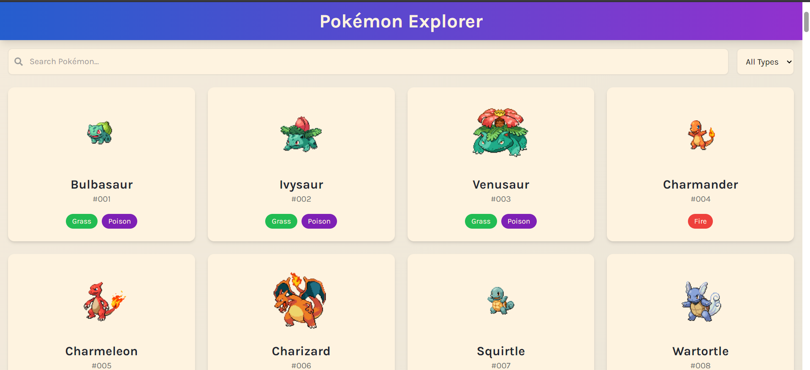
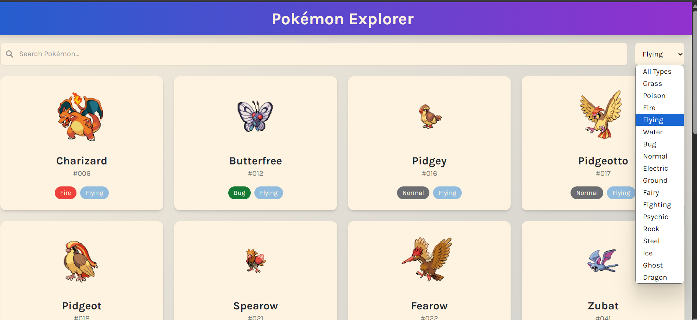

# 🐾 Pokémon Explorer

A React application that fetches data from the [PokeAPI](https://pokeapi.co/) and allows users to explore, search, and filter the first 150 Pokémon by name or type.

## 🌐 Live Demo

🔗 (https://pokemon-explorer-gules.vercel.app/)

## 📂 GitHub Repository

🔗 (https://github.com/Arbaz001/pokemon_explorer)

---

## 📸 Preview

<!-- Optional: add a screenshot if available -->
<!-- Optional: add a screenshot if available -->

---

## 🚀 Features

- ✅ Fetches first 150 Pokémon using the PokeAPI
- 🔍 Real-time search by name
- 🎯 Filter Pokémon by type (e.g., Fire, Water, Grass)
- 🃏 Displays each Pokémon in a responsive card layout with:
  - Name
  - Image (sprite)
  - Types
  - ID number
- 📱 Fully responsive for desktop and mobile
- 📦 Built with functional components and React Hooks
- ⚠️ Handles loading states, empty results, and API errors gracefully

---

## 🛠️ Tech Stack

- **React** (with Hooks)
- **CSS** / Tailwind CSS 
- **PokeAPI** for data
- **Vercel** for deployment

---

## 🔧 Getting Started

### 1. Clone the repo

```bash
git clone https://github.com/Arbaz001/pokemon-explorer.git
cd pokemon-explorer
```

### 2. Install dependencies

```bash
npm install
```
```bash
npm run dev
```

---

## ⚙️ API Usage

- Pokémon List:  
  `https://pokeapi.co/api/v2/pokemon?limit=150`

- Individual Pokémon Details (includes types, sprite, ID):  
  Fetched individually using each Pokémon's URL from the list.

- Types List (for dropdown):  
  `https://pokeapi.co/api/v2/type`

---

## 📌 Edge Case Handling

- Loading indicators while fetching
- "No Pokémon found" message on empty search/filter
- Error message if API request fails

---

## 🙌 Acknowledgments

- Thanks to [PokeAPI](https://pokeapi.co/) for the awesome Pokémon data!
```

---

